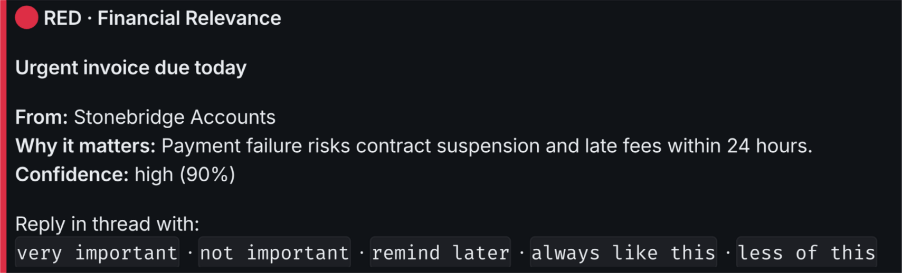
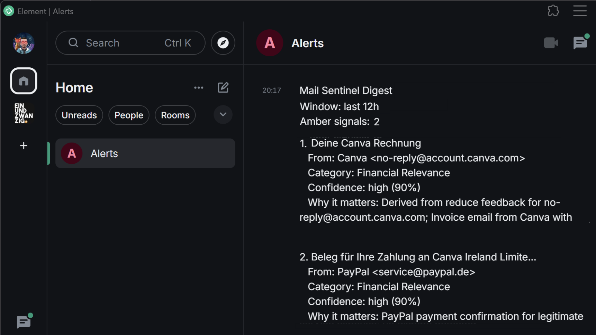
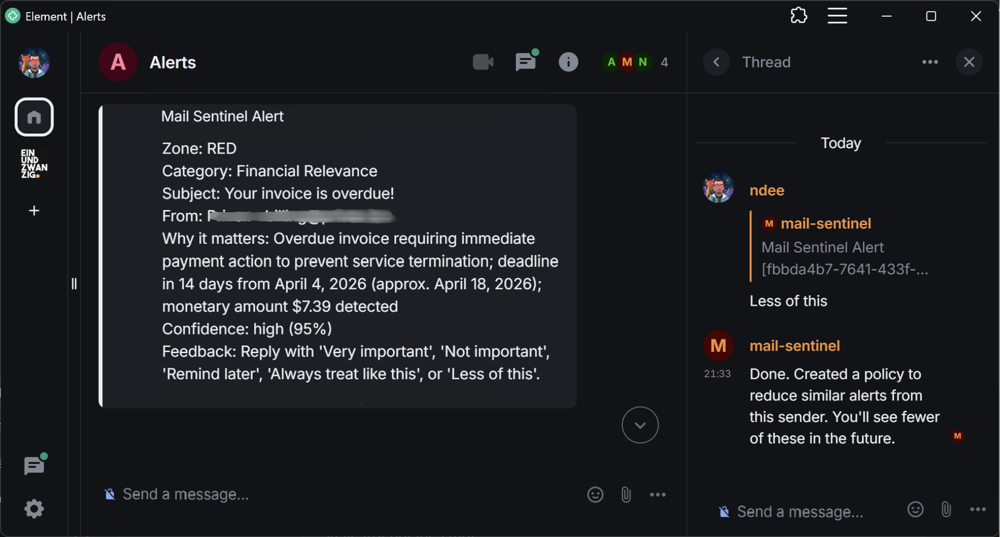
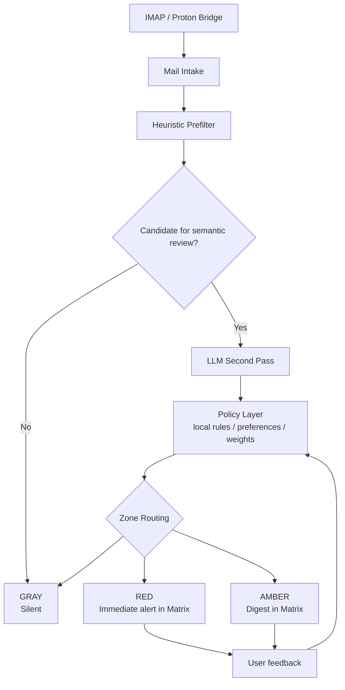

# sovereign-ai-bots

Installable bot packages for [Sovereign AI Node](https://github.com/ndee/sovereign-ai-node).

This repository contains the packaged bot modules consumed by `sovereign-ai-node`. It is not the runtime itself. It is the bot package layer.

## Purpose

`sovereign-ai-bots` exists to keep bot packages:

- modular
- inspectable
- versioned
- installable
- separate from the core runtime

Sovereign AI Node provides the runtime, Matrix control plane, and policy boundaries.
This repository provides the installable bot packages that run inside that environment.

## Relationship to Sovereign AI Node

| Layer | Repository | Role |
|---|---|---|
| **Runtime** | [`sovereign-ai-node`](https://github.com/ndee/sovereign-ai-node) | Installer, Matrix stack, agent/tool contracts, policy boundaries |
| **Bots** | `sovereign-ai-bots` | Packaged bot definitions, workspace files, manifests |

**Node runs bots. This repo defines packaged bots.**

## Package structure

Each bot package lives under:

`bots/<id>/`

A package can contain:

- `sovereign-bot.json` — package manifest
- `workspace/` — files copied into the managed bot workspace
- `avatar.png` — optional Matrix avatar for that bot's dedicated account

The repo root can also carry shared Matrix avatar assets used by the runtime:

- `service-bot.png` — default avatar for the primary service bot
- `alert-room.png` — avatar for the bundled Matrix alert room

## Current packages

- `bali-compass`
- `bitcoin-skill-match`
- `mail-sentinel`
- `project-sentinel`
- `reality-alignment`
- `node-operator`
- `reality-alignment`

---

## Mail Sentinel

Mail Sentinel is the first concrete module on Sovereign AI Node. It monitors an IMAP mailbox locally, classifies incoming signals using a heuristic prefilter and LLM second pass, and routes what matters into Matrix.

### What it looks like


Mail Sentinel surfaces high-signal messages in Matrix with a compact zone/category line and the subject as the headline.


Mail Sentinel can group relevant messages into a calm digest with unnumbered items and feedback that references the item by subject or sender.


Operator feedback updates local policy and influences future routing.

### How it works



Not every message reaches the LLM. Heuristic filters run first to discard obvious noise. Messages that pass the prefilter get a semantic second pass, then route through a local policy layer that controls zone assignment (RED, AMBER, GRAY). Operator feedback — submitted directly in Matrix — updates local scoring rules and preferences, which shifts future routing. Matrix is the delivery surface for all alerts and digests.

Mail Sentinel does not train a model locally. It adapts by updating local policy: scoring adjustments, category weights, and routing preferences driven by operator feedback.

The packaged baseline rules file (`config/default-rules.json`) is installer-managed and reapplied on install/update so shipped heuristics stay aligned with the current bot version. Operator-specific preferences and feedback stay in local policy/state files instead of editing that packaged defaults file in place.

### Prerequisites

Mail Sentinel requires:

- an IMAP-accessible mailbox with credentials
- Sovereign AI Node installed on a dedicated Ubuntu or Debian host (VM, bare metal, or VPS)
- provider credentials (OpenRouter API key) configured at the node level — see [`sovereign-ai-node`](https://github.com/ndee/sovereign-ai-node)

If the mailbox source is Proton Mail, [Proton Bridge](https://proton.me/mail/bridge) must be installed and configured on the host to expose IMAP access. On the current self-hosted path, Proton Bridge is installed manually. It is not required for other IMAP providers.

### Current tested path

The current documented and tested path for Mail Sentinel is:

- Sovereign AI Node on a dedicated Ubuntu or Debian host (VM, bare metal, or VPS)
- Matrix as control plane (provisioned by the installer)
- IMAP mailbox (any provider, or Proton Mail via Proton Bridge)
- provider-backed runtime path with an OpenRouter API key (configured at node level)

### Signal fields

Each classified message includes:

- **Zone + category** — rendered together on one compact line, e.g. `RED · Risk / Escalation`
- **Subject** — shown as the headline, not as a labelled `Subject:` field
- **From** — normalized operator-facing sender display (display name when present, otherwise the email localpart)
- **Why it matters** — short explanation of the routing decision
- **Confidence** — model confidence in the classification
- **Feedback** — operator action to refine future routing; digest follow-ups reference the visible item by subject or sender

Visible Matrix alerts and digests stay compact on purpose: internal alert IDs and raw message IDs are kept in local state, but are not shown in the rendered operator message.

---

## node-operator

The operational bot for interacting with the local node.

It:

- inspects node state
- assists with operator-facing tasks
- exposes controlled operational functionality

---

## Project Sentinel

Project Sentinel is a project intelligence bot for Sovereign AI Node.

It watches a small, curated set of trusted upstream and community sources,
classifies relevance against project lanes such as Matrix, OpenClaw, mail stack,
and node operations, then routes only the resulting signals into Matrix:

- `RED` for immediate review
- `AMBER` for digest-first review
- `GRAY` for silence

It is intentionally not a broad AI-news feed. The goal is calm operational
intelligence for dependencies and ecosystem changes that matter to Sovereign AI
Node.

Package README:

- [`bots/project-sentinel/README.md`](bots/project-sentinel/README.md)

---

## Reality Alignment

Reality Alignment is an experimental personal self-coaching bot for Sovereign AI Node.

It tracks:

- active wishes
- daily alignment check-ins
- recurring resistance patterns
- one concrete next aligned step at a time
- a weekly review digest

It uses a dedicated Matrix account, supports DMs, and can also auto-reply in the alert room.

This package is intentionally scoped for grounded self-reflection. It is **not** therapy and **not** a manifestation engine.

## Trust model

Bot packages should remain compatible with the Sovereign AI Node trust model:

- local-first by default
- no mandatory telemetry
- cloud or hybrid behavior only when explicitly enabled
- tool access mediated by node policy boundaries
- inspectable package contents before installation

## Tooling

Catalog validation, probe tooling, and bot runtimes use TypeScript. The
`mail-sentinel` bot source lives under `bots/mail-sentinel/src/` and tsup
bundles it into a single file at `bots/mail-sentinel/workspace/bin/dist/
mail-sentinel.js` (gitignored). The manifest (`sovereign-bot.json`) and
systemd unit both reference the compiled `mail-sentinel.js`. `pnpm build`
must run before any `pnpm catalog:*` command because the validator
checks that `hostResources[].spec.source` exists on disk.

Common commands:

- `pnpm lint` — Biome checks for `src/` and `bots/*/src/`
- `pnpm typecheck` — TypeScript type-checking
- `pnpm build` — build the root CLI entrypoints into `dist/` and the current
  Mail Sentinel bot bundle into `bots/mail-sentinel/workspace/bin/dist/`
- `pnpm test:coverage:unit` — Vitest with 100% coverage on catalog tooling
  and every bot's TypeScript source tree
- `pnpm catalog:lint` — validate all `bots/**/*.json` files and canonical
  JSON formatting (run `pnpm build` first)
- `pnpm catalog:typecheck` — schema-check all bot manifests
- `pnpm catalog:test` — run catalog invariants
- `pnpm catalog:smoke` — copy source-backed host resources into a temp
  directory
- `pnpm probe:mail-sentinel-model` — manually probe the Mail Sentinel model
  declared in `bots/mail-sentinel/sovereign-bot.json` via OpenRouter

### Running a bot CLI during development

To run `mail-sentinel` without a full build, use `tsx` against the
source entry point:

```bash
tsx bots/mail-sentinel/src/cli.ts <command> --instance <id> --json
```

For a production-style run, `pnpm build` first then invoke
`node bots/mail-sentinel/workspace/bin/dist/mail-sentinel.js ...`.

## Long-term direction

Over time, this repo should grow into a catalog of specialized modules for Sovereign AI Node spanning mail, documents, calendars, operations, security, and finance.

## Related

- [`sovereign-ai-node`](https://github.com/ndee/sovereign-ai-node) — open-core runtime and control plane
